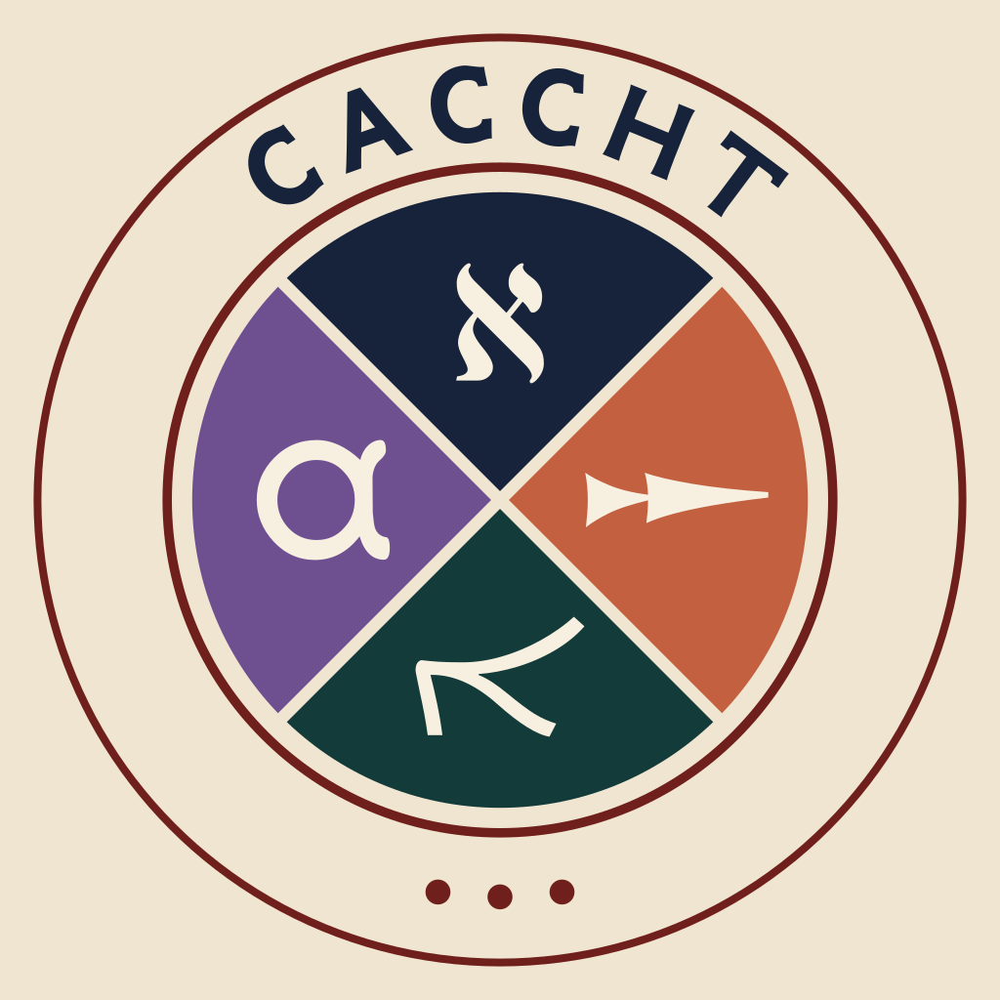

# The Samaritan Pentateuch

[](https://doi.org/10.5281/zenodo.7734632) [](https://creativecommons.org/licenses/by-nc/4.0/) 


This is the [Text-Fabric](https://github.com/annotation/text-fabric) representation of the Samaritan Pentateuch.
The dataset is work in progress, and so far, we have added a number of word features, which you find in the tf folder. The [feature documentation](https://github.com/DT-UCPH/sp/blob/main/docs/README.md) can be found in the docs folder. They are similar to those of the Biblia Hebraica Stuttgartensia Amstelodamensis (BHSA), so we refer to the [BHSA feature documentation](https://etcbc.github.io/bhsa/) for more explanation of the features.
Apart from word level annotations, the dataset contains phrase (atom) boundaries and clause (atom) boundaries. Phrase features like phrase type and phrase function will be added later.

### Publications

For an introduction to the dataset and its features, see these papers:

Naaijer, M., Højgaard, C. C., Schorch, S., & Ehrensvärd, M. (2024). Text-Fabric Dataset of the Samaritan Pentateuch. Research Data Journal for the Humanities and Social Sciences, 9(1), 1-13. https://doi.org/10.1163/24523666-bja10051

Cantanhêde, S. d. O., Naaijer, M., Højgaard, C. C., & Glanz, O. (2026). Identifying Phrase Boundaries in the Samaritan Pentateuch with Machine Learning. Religions, 17(2), 192. https://doi.org/10.3390/rel17020192

### Use of the dataset

You can use the dataset freely for research and education. If you do so, please refer to the papers. Also refer to the dataset in the following way:

Christian Canu Højgaard, Martijn Naaijer, & Stefan Schorch. (2023).
Text-Fabric Dataset of the Samaritan Pentateuch. Zenodo.
https://doi.org/10.5281/zenodo.7734632

You can also refer to specific versions of the dataset.
 
### The CACCHT project: Creating Annotated Corpora of Classical Hebrew Text

This dataset is developed as part of the [CACCHT project](https://github.com/CACCHT), which is a collaboration of Christian Canu Højgaard, Martijn Naaijer, Martin Ehrensvärd, Robert Rezetko, Oliver Glanz, and Willem van Peursen. The goal of CACCHT is to prepare and publish ancient Semitic texts digitally that can be used for research.

### Text

The text was provided by the Samaritanus-project based at Martin-Luther-Universität Halle-Wittenberg, directed by Stefan Schorch, and is based on a transcription MS Dublin Chester Beatty Library 751 (Gen 1-Deut 32:36) + MS Garizim 1 (Deut 32:36b-34), cf. Stefan Schorch (ed.), The Samaritan Pentateuch: A critical editio maior. Berlin: de Gruyter, 2018-.

We have made a small change in the original verse division. Instead of assigning the additions after Genesis 30:36 to the verse numbers 36a, 36b, and 36 c, we group these under verse 36.

## Get started

This data can be processed by Text-Fabric.

Text-Fabric will automatically download the SP data.

After installing Text-Fabric, you can start the Text-Fabric browser by this command

```text-fabric dt-ucph/sp```

Alternatively, you can work in a Jupyter notebook and say

```from tf.app import use
A = use('dt-ucph/sp')
```

In both cases the data is downloaded and ends up in your home directory, under text-fabric-data.

For a general tutorial to working with Text-Fabric in a Jupyter notebook, we recommend [start](https://nbviewer.jupyter.org/github/etcbc/bhsa/blob/master/tutorial/start.ipynb)
and
[search](https://nbviewer.jupyter.org/github/etcbc/bhsa/blob/master/tutorial/search.ipynb), both of which use the BHSA database of the Hebrew Bible.

## Versions

This repo is work in progress. Before version 2.0, the dataset consisted of the text of Genesis. In 3.0 all morphemes have been added for the entire Samaritan Pentateuch. In 4.0 phrase atom boundaries have been added for the entire text.

Version
- 0.1 November 2022 First data of the book of Genesis.
- 1.0 December 2022.
- 2.0 February 2023 Addition of g_cons_raw of Exodus-Deuteronomy.
- 3.0 June 2023 Addition of all morphemes of Genesis-Deuteronomy.
- 4.0 May 2025 addition of phrase atoms by Saulo de Oliveira Cantanhêde.
- 5.0.1 October 2025 addition of phrases.
- 6.0.0 February 2026 addition of clause atoms.
- 7.0.0 April 2026 addition of clauses.
- 7.1.0 July 2026 addition of phrase types.

### Features
Currently, the following features exist for all books.
- book
- chapter
- verse
- g_cons
- lex
- gloss
- sp
- g_vbs
- g_pfm
- g_lex
- g_vbe
- g_nme
- g_uvf
- g_prs
- vt
- ps
- nu
- gn
- prs_ps
- prs_nu
- prs_gn
- language
- trailer

### Textual issues
Some annotations are dubious due to idiosyncrasies in the SP manuscript used for this project. The issues are documented in the folder textual_issues.